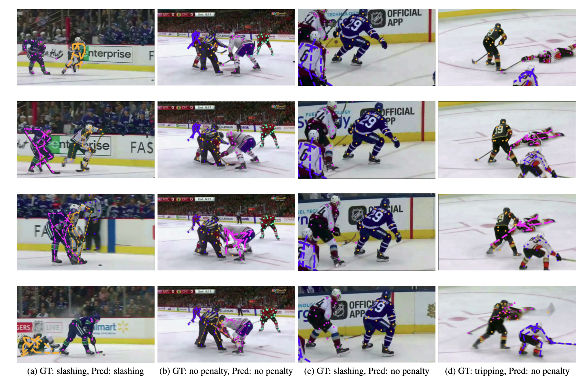

# Interaction Classification With Key Actor Detection In Videos

Official source code for our paper titled "Interaction Classification With Key Actor Detection in Multi-Person Sports Videos" which has been accepted at the CVsports Workshop, CVPR'22. [[pdf]](https://openaccess.thecvf.com/content/CVPR2022W/CVSports/papers/Askari_Interaction_Classification_With_Key_Actor_Detection_in_Multi-Person_Sports_Videos_CVPRW_2022_paper.pdf)

Note: Our hockey dataset will be released soon

This repository contains the implementation of our convolutional recurrent neural network for action recognition and key player identification. Many activities in real life take place around many people, however only a few are actually involved in the action. With the help of a suitable attention mechanism inside our action recognition model, we are able to identify the key players involved in the penalty without explicit annotations.

|  | 
|:--:| 
| Link between the attention performance and classification accuracy. In figures (a) and (b), our model correctly gives more attention to the 'key' players (the referee who is not involved in the penalty is given almost zero weight) and is able to classify the penalty correctly. In figures (c) and (d), where our model makes an incorrect prediction, we also notice that the attention weight is more for the non-key players. |

## Installation
1. Clone this repository. 
	```
	git clone git@github.com:SummerVideoAnalysis/Key-Actor-Detection.git
	cd Key-Actor-Detection
	```
2. Create and activate python virtual environment. Note that we need python>=3.7.
	```
	virtualenv --python=/usr/bin/python3.7 venv
	source venv/bin/activate
	```
3. Install required packages.
	```
	pip install -e .
	```
4. Optional : If you do not have the SBU Kinect Dataset downloaded, please create the empty directory `datasets/sbu/folds_cache`in the cloned repo. The dataset will be automatically downloaded in `datasets/sbu` and any caching (loaded images and poses as pickle files) will be saved in `datasets/sbu/folds_cache`. To do this simply run - ```mkdir -p datasets/sbu/folds_cache```.

## Overview
Four models have been implemented for activity recognition where each model builds on the previous one. A CNN encoder has been used for encoding frame level features and LSTMs have been used for decoding the action using the frame level features as well as pose information.

Model 1 - Only frame level features <br />
Model 2 - Only averaged pose features <br />
Model 3 - Only weighted pose features (using two types of attention mechanism) <br />
Model 4 - Frame level features + Weighted pose features <br />

## Datasets
- [x] SBU Kinect Dataset
- [x] Hockey Dataset (will be released soon)

Hockey dataset directory structure - 

```
.
└── hockey_dataset/
    ├── No_penalty/
    │   ├── _2017-11-05-col-nyi-home10/
    │   │   ├── frame_0000.png
    │   │   ├── ...
    │   │   ├── frame_0063.png
    │   │   └── skeleton.json
    │   ├── _2017-11-11-nyi-stl-home492
    │   └── ...
    ├── Slashing/
    │   └── ...
    └── Tripping/
        └── ...
```

## Training
The models can be trained either on a single GPU, multiple GPUs on the same machine or on multiple GPUs across nodes managed by SLURM. The latter two uses distributed dataparallel where each GPU is associated with a separate training process.

Hyperparameters can be defined in the configuration file `(e.g in configs/sbu.yaml)` or overridden through command line arguments. 


### On Local Machine

- Define hyperparameters in `configs/sbu.yaml` or `configs/hockey_dataset.yaml`. Then run - 
	```bash
	python run.py configs/sbu.yaml or python run.py configs/hockey_dataset.yaml
	```
	
- Override values in config file through command line arguments -
	```bash
	python run.py configs/sbu.yaml "training.learning_rate=0.002"
	```

### SLURM Managed Cluster

- Modify resource requirements and overrides in the training comand in `scripts/train_slurm.sh` and then submit job. 
	```bash
	sbatch scripts/train_slurm.sh
	```

## Hyperparameter Optimization

The hyperparameters of the model are optimized using the Ax optimization tool which uses the Bayesian strategy to sample new points.

### On Local Machine

- Define hyperparameter bounds and constraints in the `opt_parameters` python list variable in`key_actor_detection/optimization/ax_hyperparameter_optimization.py`. Then run - 
	```bash
	python key_actor_detection/optimization/ax_hyperparameter_optimization.py configs/sbu.yaml
	```

### SLURM Managed Cluster

- Modify resource requirements and hyperparameter bounds and constraints as mentioned above and then submit job. 
	```bash
	sbatch scripts/optimize_slurm.sh
	```
	Trials are evaluated sequentially with each trial executed on multiple GPUs. Presently, simultaneous evalutation of multiple trials on multiple GPUs is not supported.

## Data Augmentation

We used [imgaug](https://github.com/aleju/imgaug)  for image and keypoint augmentation.

## Citation
If you find this work useful for your research, please cite our paper:
```
@InProceedings{Askari_2022_CVPR,
    author    = {Askari, Farzaneh and Ramaprasad, Rohit and Clark, James J. and Levine, Martin D.},
    title     = {Interaction Classification With Key Actor Detection in Multi-Person Sports Videos},
    booktitle = {Proceedings of the IEEE/CVF Conference on Computer Vision and Pattern Recognition (CVPR) Workshops},
    month     = {June},
    year      = {2022},
    pages     = {3580-3588}
}
```